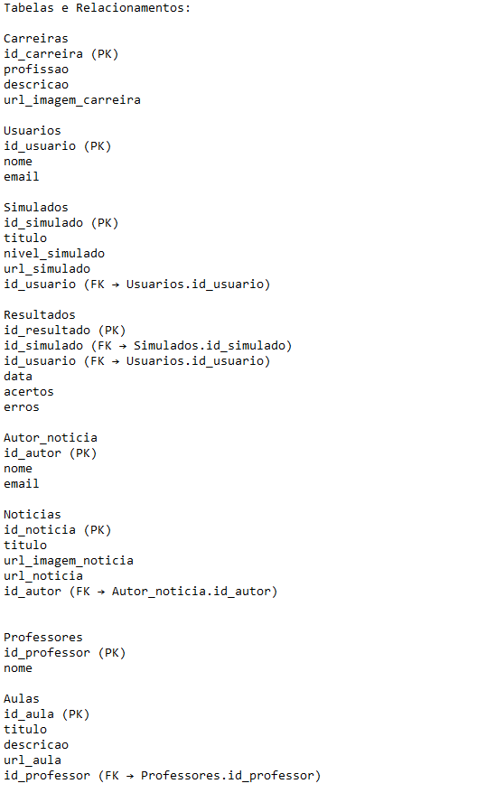
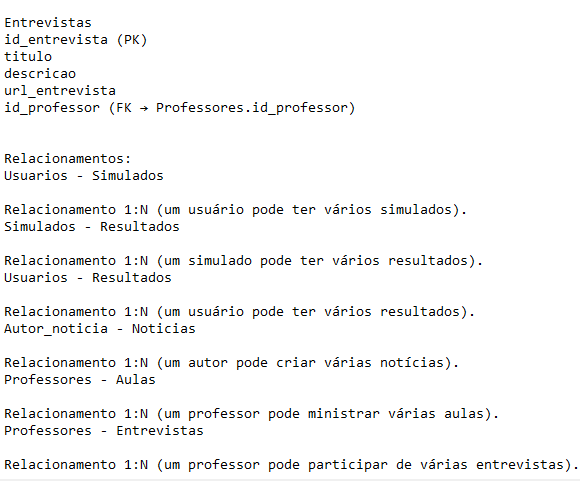

# Projeto de Banco de Dados para Site de Biologia

## Descrição do Projeto

Este projeto consiste na criação de um banco de dados para um site de biologia. O banco de dados armazena informações sobre carreiras, usuários, simulados, resultados, autores de notícias, notícias, professores, aulas e entrevistas. O objetivo é fornecer uma estrutura robusta para gerenciar e acessar essas informações de maneira eficiente.

## Estrutura do Banco de Dados

### Modelo Entidade-Relacionamento (MER)

**Realizado por Gabriela Moleta**

### Diagrama Entidade-Relacionamento (DER)

**Der não realizado**

**Responsáveis: Nicole Cau e Ana Clara Micheletto**

## Tabelas e Inserções

### Tabelas Criadas

**Pablo Delgado**: Criação das tabelas carreiras e usuários.

**Sophia Balico**: Criação do banco de dados site_biologia e das tabelas adicionais (simulados, resultados, autor_noticia, noticias, professores, aulas, entrevistas).

### Inserções de Dados

**Pablo Delgado**: Inserts nas tabelas "carreiras" e "usuarios".

**Sophia Balico**: Insert na tabela "professores".

**Gabriela Moleta**: Inserts nas tabelas "entrevistas" e "aulas".

**Nicole Cau**: Inserts nas tabelas "autor_noticias" e "simulados".

**Ana Micheletto**: Insert na tabela "noticias".